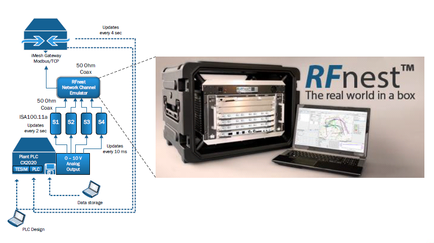

# Tennessee Eastman HIL Simulator
This repository contains code that allows the Tennesse Eastman (TESIM) 
chemical process model to be simulated using hardware-based simulator 
architectures.  Using the code within this repository will allow for 
integration with external sensor and actuator equipment.  

The TESIM simulator 
is intended for wireless and cybersecurity research purposes.  The code is optimized
for wireless system integration as a part of the NIST Industrial Wireless project; 
however, the original purpose was for use with the NIST industrial cybersecurity project.

DISCLAIMER: Certain commercial equipment, instruments, or materials are identified in this paper in order to specify the experimental procedure adequately.  Such identification is not intended to imply recommendation or endorsement by NIST, nor is it intended to imply that the materials or equipment identified are necessarily the best available for the purpose.

## Repository Structure
* c:        Includes the C++ simulator code
* cad:      Includes related CAD diagrams 
* analysis: Includes scripts used for analysis of simulator output
* lib:      Includes submodule (tesim_ads_comms) for Beckhoff CX2020 integration

## C++ Code
The C++ code is written for execution on a Windows platform.  Installation of 
Microsoft Visual Studio is required to make use of the TESIM project structure.
The C++ Solution is structured as follows:
* tesimlib:         Library used for the TESIM model
* tesim:            The TESIM executable which runs without HIL integration
* tesim2plc:        The TESIM executable which runs with ADS Comms (Beckhoff) integration
* rtclient:         Executable allowing run-time modification of set-points and control parameters
* testsignals:      Executable to inject ramp and pulse train test signals
* testsignals2plc:  Executable to inject ramp and pulse train test signals with ADS Comms (Beckhoff) integration

## Analysis Code
No contributions as of yet.  

## HIL Integration
The TESIM simulator integrates with analog sensors using the Beckhoff ADS Protocol.  By integrating with
sensors, we are able to employ an RF channel emulator to recreate the factory RF environment as shown in 
the following figure.  This allows us to examine the impacts of the wireless network on factory 
operational performance.  Shown in the diagram is an example of how our system is used to evaluate TESIM
factory performance using ISA100.11a sensors.  IEEE 802.11 integration is underway.

